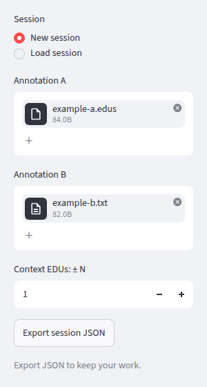
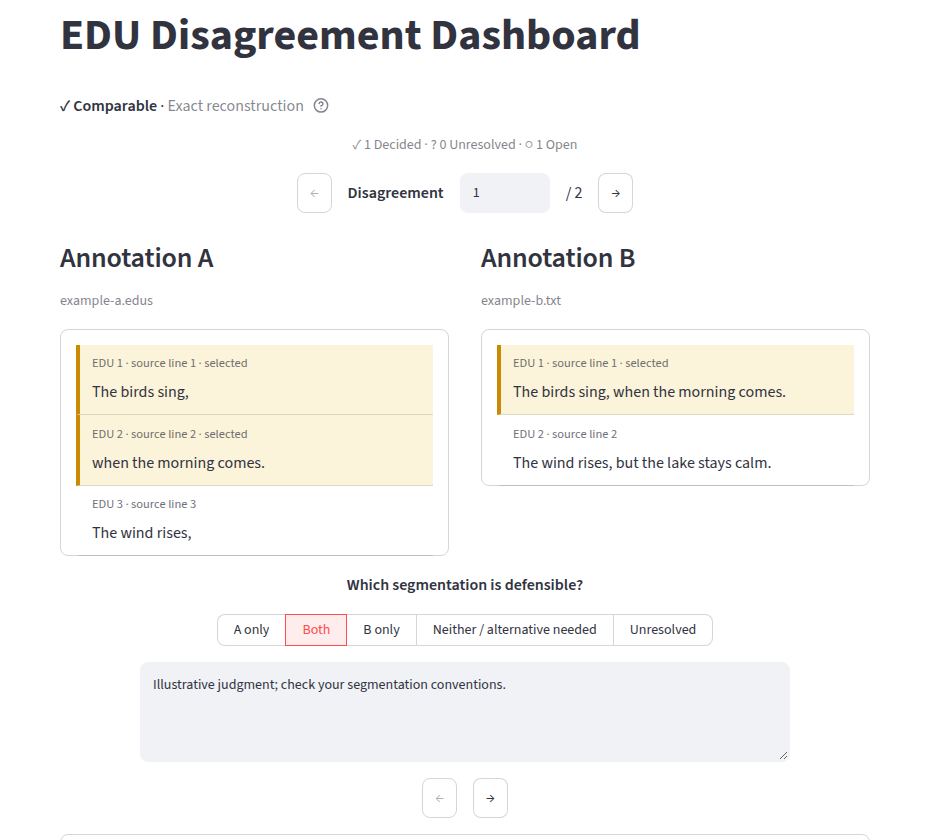
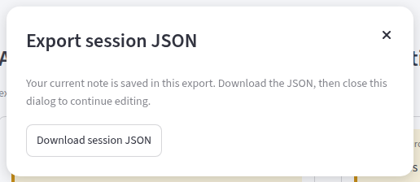

# Using the EDU Disagreement Dashboard

The dashboard helps you inspect and assess differences between two segmentations into elementary discourse units (EDUs). Annotation A and Annotation B have equal standing: neither is a gold standard, and a disagreement does not by itself mean an annotation error.

A **disagreement region** groups all differing EDU boundaries between two consecutive boundaries shared by A and B. The beginning and end of the document also delimit regions. Several differing boundaries may therefore belong to one disagreement.

## Run locally

You need Python 3.10 or newer and [uv](https://docs.astral.sh/uv/). Open a terminal in the project folder and run:

```sh
uv sync
uv run streamlit run app/streamlit_app.py
```

Open the local address printed in the terminal, usually `http://localhost:8501`. Keep that terminal running while using the dashboard. Press Ctrl+C in the terminal to stop it.

## Start a session

In the sidebar, choose **New session**, then upload one file under **Annotation A** and one under **Annotation B**. Comparison starts automatically when both are present.

Both `.txt` and `.edus` mean the same thing here:

- UTF-8 text, with one non-empty line per EDU. Convert files in other encodings to UTF-8 beforehand; the dashboard does not detect or convert encodings.
- Line breaks separate EDUs. LF and CRLF line endings are supported.
- Empty lines are ignored. Lines containing only spaces or tabs are still EDUs.
- All other content is preserved, including leading/trailing spaces and punctuation. Include only EDU text; headers, IDs, or comments would be treated as EDUs too.

The annotations must describe the same character sequence, allowing differences in whitespace placement. See [comparison modes](#comparison-modes) below.



All screenshots in this guide use invented example annotations. The displayed judgment is illustrative.

## Inspect and assess disagreements

Use the centered arrows above or below the assessment to move through disagreements. To jump, enter a number in **Disagreement** and press Enter or leave the field.

The left and right panels show the selected disagreement's original EDUs. Highlighted EDUs belong to that region; unhighlighted EDUs provide context. **Context EDUs: ± N** in the sidebar changes the number of neighboring EDUs shown on each side, from 0 to 10 (default 1). This changes only the view, not the comparison. A and B may contain different numbers of EDUs; their rows are not forced into alignment.

Answer **Which segmentation is defensible?**:

| Choice | Meaning |
| --- | --- |
| A only | A is defensible; B is not. |
| Both | Both segmentations are defensible. |
| B only | B is defensible; A is not. |
| Neither / alternative needed | Neither current segmentation is satisfactory; an alternative may be required. |
| Unresolved | You inspected the disagreement but cannot currently decide. |

An **Open** disagreement has no assessment. **Unresolved** is an explicit assessment and counts as reviewed. The other four choices count as **Decided**. “All disagreements reviewed” means none are open; unresolved judgments may remain. Choosing Both does not automatically establish genuine human label variation (HLV).

Choose a verdict to enable the optional note field. Notes belong to individual disagreements and return with their verdict when revisited. Leaving the field or pressing Ctrl+Enter commits a note edit to the running session. Selecting a verdict does not advance automatically. Clicking the selected verdict again clears that assessment, including its note.



**Full annotations**, **Comparison summary**, and **Developer diagnostics** are collapsed below the main view. Expand them when useful; full-annotation panes scroll independently.

## Export and resume work

**Export JSON is the durable save mechanism.** Verdicts and notes otherwise live only in the running browser session. Refreshing or closing the page, or restarting the app, can lose them; there is no browser-tab closing warning. Export before these actions and periodically during assessment.

If the current session contains any assessments, switching between New session and Load session, replacing/removing annotations, or loading a different JSON asks **Replace current session?**:

> Your current assessments may be lost. Export your session JSON before continuing.

**Cancel** preserves the active comparison, assessments, notes, and position. Closing the dialog with X or Escape also cancels. Cancel first if you need to export. **Continue** applies the input change and discards the old session; loading JSON restores that file's saved work. An untouched session changes without a warning. Pending note edits received from the note field are retained when canceling.

After canceling a file change, the native uploader may still show the canceled selection, or remain empty after removal. The active comparison still uses the previous sources. An unchanged canceled selection stays unapplied; to retry a canceled replacement, remove and reselect that file.

1. Click **Export session JSON** in the sidebar. This commits any pending note edit and prepares a snapshot.
2. In the dialog, click **Download session JSON**. The filename includes a UTC timestamp, for example `edu_assessment_20261008_143000_UTC.json`. Your browser controls where it is saved.
3. Close the dialog to continue. Later edits require another export.
4. To resume, choose **Load session** and upload the downloaded file under **Session JSON**. You do not need to upload A and B separately.



The JSON restores both annotations, assessments, notes, current disagreement, and context setting. It embeds the complete original A/B texts, filenames, and integrity hashes; it does not rely on paths to the original files. Comparison is recomputed on load and saved assessments must match the resulting regions.

**Session JSON may contain private or licensed material**, including the full annotations and your notes. Treat the exported file accordingly when storing or sharing it. There is no persistent server database or automatic disk saving.

## Comparison modes

- **Exact reconstruction:** removing EDU line breaks and concatenating the line contents produces exactly the same text on both sides. No spaces are inserted during reconstruction.
- **Whitespace-normalized:** reconstructions differ only in whitespace placement. Whitespace is ignored when comparing boundaries, while the original EDU text remains unchanged in the panels. The canonical text in Developer diagnostics is a derived, whitespace-free representation.

The information control beside the mode explains both. Neither mode ranks A or B or assigns a reliability score.

## Limits and common problems

| Problem | What to check |
| --- | --- |
| UTF-8 error | Convert the source file to UTF-8 outside the app, then upload it again. |
| Not comparable: content mismatch | Check spelling, punctuation, quotes, dashes, Unicode character forms, and missing/repeated text. Only whitespace differences are handled; the app does not repair or align other differences. |
| Boundary projection error | Whitespace removal has collapsed distinct boundaries. Inspect whitespace-only EDU lines; the app rejects this rather than merging decisions. |
| Session validation error | Use a valid exported JSON. Malformed JSON, unsupported versions, hash mismatches, and assessments that do not match recomputed regions are rejected. |
| No segmentation differences | There are no regions to assess. Full annotations and session export are still available. |
| Long annotations | Use the direct disagreement number and smaller context. Full panes do not synchronize scrolling or jump to the selected region. |

Only `.txt`/`.edus` annotations and session JSON are supported. There is no adjudicated segmentation editor, guideline interface, automatic linguistic diagnosis, LLM assistance, or agreement scoring. See the [comparison contract](first_slice.md) for technical details and the [roadmap](roadmap.md) for possible future work.
